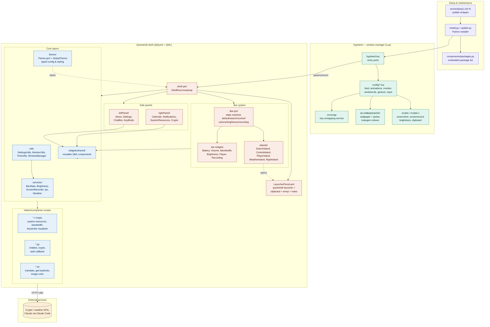

<div align="center">


<br/>

# ArchEclipse

**Hyprland desktop that just works — daily-driven, fully themed, one-command install.**

Personal fork of [AymanLyesri/ArchEclipse](https://github.com/AymanLyesri/ArchEclipse).

[](https://discord.gg/fMGt4vH6s5)
[](https://archlinux.org/)
[](https://hyprland.org/)
[](https://quickshell.org/)
[](https://doc.qt.io/qt-6/qtquick-index.html)
[](https://python.org/)
[](https://github.com/bushninjadots/ArchEclipsedots/stargazers)
[](https://github.com/bushninjadots/ArchEclipsedots/issues)

</div>

---

## TL;DR

- **What:** Arch + Hyprland + custom Quickshell UI. Bar, launcher, panels, theming — all integrated.
- **Install:** 1 command (below). Update with `archeclipse`.
- **Try first:** `SUPER + W` = wallpapers. Full keys: [bind.lua](https://github.com/bushninjadots/ArchEclipsedots/blob/master/.config/hypr/config/bind.lua).

---

## Install

**Need:** Arch / Arch-based + Hyprland + Python 3. Rest is auto-installed.

```bash
python3 <(curl -fsSL https://raw.githubusercontent.com/bushninjadots/ArchEclipsedots/refs/heads/master/.config/hypr/maintenance/install.py)
```

```bash
archeclipse   # update anytime (zsh fn → runs maintenance/update.py)
```

---

## What you get

| Need | How |
| ---- | --- |
| **Bar** | Modular widgets: workspaces, bandwidth, weather, player, tray, crypto |
| **Launcher** | App search + clipboard + emoji + calc + URLs + custom cmds. No Rofi. |
| **Right panel** | Player, notifications, calendar, crypto |
| **Left panel** | Claude chatbot, keybinds, settings |
| **Theming** | Wallpaper → full system colors via matugen. Light/dark toggle. Hot-reload. No manual edits. |

**Stack:** QML/QtQuick (Quickshell) · Python 3 + Bash · C (perf utils) · Hyprland/Wayland

| Workspace | Opens |
| --------- | ----- |
| W2 / W4 / W5 / W6 / W7 / W10 | Browser / Spotify / Btop / Discord / Steam / Games |
| W1, W3, W8, W9 | General |

> Apps auto-launch to their workspace at login.

---

## Essentials

- **Avatar:** `$HOME/.face.icon`
- **Wallpapers:** `SUPER + W` → [qs-wallpaperpicker](https://github.com/dhrruvsharma/qs-wallpaperpicker). Add yours to `$HOME/Pictures/wallpapers`
- **Hyprland tweaks:** `$HOME/.config/hypr/config/custom`
- **Laptop:** install `upower` for battery
- **Keys:** [bind.lua](https://github.com/bushninjadots/ArchEclipsedots/blob/master/.config/hypr/config/bind.lua) or Left Panel in-app

---

<details>
<summary><b>How it works — architecture, theming, widgets (click to expand)</b></summary>

<br/>

**One idea:** UI + scripts + theming ship as one product. Not random dotfiles.

### Architecture



### Theming

- Wallpaper → colors via [matugen](https://github.com/InioX/matugen) (Material You): shell, kitty and the picker follow the wallpaper.
- Auto-applies to Quickshell, terminal, UI. Zero manual edits.
- Static, animated and video wallpapers drawn by [qs-wallpaperpicker](https://github.com/dhrruvsharma/qs-wallpaperpicker), with local, favourites and Wallhaven sources. Light/dark toggle. Hot-reload.

### Widgets (Quickshell / QML)

- Reactive QML via `shell.qml` + singletons (`BarState`, `GlobalTheme`, `Weather`).
- Bar slots swappable at runtime.
- Note: migrated from Eww/AGS on 2026-09-12. Old `~/ArchEclipse-AGS` / `~/agsv1` folders are safe to delete.

### Launcher details

Fuzzy search · clipboard history · emoji · calc · URL forward · custom cmds.

### Panels detail

- **Right:** media, notifications, calendar, script runner, crypto.
- **Left:** Claude chatbot (Opus/Sonnet/Haiku through your Claude Code login), live keybinds, Hyprland/Quickshell settings.

### Deployer

Python installer = deps + dotfiles + packages. One command in, `archeclipse` keeps you updated.

</details>

---

## Roadmap

- [ ] Per-component docs _(in progress)_
- [ ] Gaming perf tuning _(in progress)_
- [ ] Ongoing polish

Bugs / ideas → [open an issue](https://github.com/bushninjadots/ArchEclipsedots/issues).

---

## Visuals

### Launcher


### Right Panel

| Player · Calendar · Notifications | Calendar · Player · Resources |
| --- | --- |
|  |  |

### Left Panel

| Chatbot | Settings | Keybinds |
| ------- | -------- | -------- |
|  |  |  |

### Workspaces · Lock


